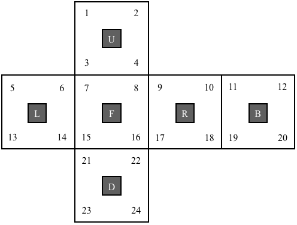

<br />
<!--  -->
<p align="center">
  <a href="https://pocket-cube-solver.herokuapp.com/" target="_blank">
    
    
  </a>
  

  <h2 align="center">Pocket Cube Solution Finder</h2>

  <p align="center">
    The api that produces list of all optimal solutions for a given position of Pocket Cube
  <br>
    <a href="https://pocket-cube-solver.herokuapp.com/"><strong>View Demo »</strong></a>
  </p>
</p>


# Pocket Cube Solution Finder 

### Base URL : https://pocket-cube-solver.herokuapp.com/

<!-- ### Rapid API:  -->

---
### About this file:
### The purpose of this file is to provide overview, documentation of the api and setup instructions of the project.  
<br/>  

# Overview
### The Pocket Cube is a 2*2\*2 version of the more popular Rubik's Cube. Even though it is less complex, the pocket cube has 3674160 combinations. 

### I have found many resources to solve this puzzle but few to list all the optimal solutions. 

### This api returns the list of all optimal solutions ( <a href="https://www.speedsolving.com/wiki/index.php/Metric#HTM" target="_blank"> QTM not HTM </a> ) for a given position string or get a random optimal solution if needed.
<br/>
<br/>

# How to get position string of a Pocket Cube state
* ## Hold the pocket cube and view the front face...
    * ### 'F' denotes the face in front of you
    * ### 'R' denotes the face to right of 'F'
    * ### 'L' denotes the face to left of 'F'
    * ### 'U' denotes the face on top of cube
    * ### 'D' denotes the bottom face of the cube
    * ### 'B' denotes the face opposite to 'F'

    

* ## Now record the colors in the same order as the numbers shown above.
* ## And now you got a 24-character position string.

<br/>


# Example
  

  ## The position string of the cube is:
  
  ## ```YWYB ORGR YBOG WWRO YBRO GBGW``` (without spaces)

<br/>

# The Solution string
*  ## The api generates a list of solutions array, where each solution is a string of atmost 14-moves. These are optimal solutions of the given position string ( <a href="https://www.speedsolving.com/wiki/index.php/Metric#HTM" target="_blank"> QTM not HTM </a> ).

* ## List of possible moves:
    * ## `R, R', U, U', F, F'` ( <a href="https://www.speedsolving.com/wiki/index.php/Metric#HTM" target="_blank"> Learn about cube moves</a> )

* ## Apply the moves of any one solution on the `F` face of the cube to solve it.


<!-- api documentation -->
<br/>

# API
**Get All Optimal Solutions**
----
  Returns json data consisting of solutions of a given cube position.

* **URL**

  /:position/all

* **Method:**

  `GET`
  
*  **URL Params**

   **Required:**
 
   `position=[String]`
    * This is the position string of a pocket cube position.
  
    <br />


* **Success Response:**

  * **Code :** 200
  *  **Content :** 
      ```json
      {
        "position": "String",
        "depth": "Integer", 
        "sols": "Array(String)"
      }
      ```
      where,
        * position stores the parameter inputted,
        * depth key contains the number of moves required to solve the given position,
        * sols contains the list of all optimal solutions which solves the given position.
        
      <br/>

  *  **Example Content :** 
      ```json
      {
        "position": "GBWGYOGYRYOORWROBRWYGWBB",
        "depth": 11, 
        "sols": [
          "R U'R U F'U F'R U F'R'",
          "R F'R F'U'R R U R'U F'",
          "R F'R F'U'R'R'U R'U F'",
          "U U R U'R'U R R F'R F'",
          "U U R U'R'U R'R'F'R F'",
          "U'U'R U'R'U R R F'R F'",
          "U'U'R U'R'U R'R'F'R F'",
          "F R U'F'U R'F'U R'U R'",
          "F'R'F U R'U F U'R U R'"
        ]
      }
      ```
* **Error Response:**

  * **Code:** 404 NOT FOUND <br />
  *  **Content :** 
      ```json
      {
        "position": "String",
        "depth": -1, 
        "sols": []
      }
      ```
  *  **Example Content :** 
      ```json
      {
        "position": "GBWGYOGYRYOORWROBRWYGWBW",
        "depth": -1, 
        "sols": []
      }
      ```
  ---
  <br/>

**Get a Random Optimal Solution**
----
  Returns json data consisting of an optimal solution of a given cube position.

* **URL**

  /:position/random

* **Method:**

  `GET`
  
*  **URL Params**

   **Required:**
 
   `position=[String]`


* **Success Response:**

  * **Code :** 200
  *  **Content :** 
      ```json
      {
        "position": "String",
        "depth": "Integer", 
        "sol": "String"
      }
      ```
      where,
        * position stores the parameter inputted,
        * depth key contains the number of moves required to solve the given position,
        * sols contains a random optimal solution which solves the given position.
        
      <br/>

  *  **Example Content :** 
      ```json
      {
        "position": "OWWYWRBGOGRGOBWBYYGBORYR",
        "depth": 9, 
        "sol": "F'R U R'U F'R R F "
      }
      ```
* **Error Response:**

  * **Code:** 404 NOT FOUND <br />
  *  **Content :** 
      ```json
      {
        "position": "String",
        "depth": -1, 
        "sol": null
      }
      ```
  *  **Example Content :** 
      ```json
      {
        "position": "OWWYWRBGOGRGOBWBWYGBORYR",
        "depth": -1, 
        "sol": null
      }
      ```

<!-- api documentation -->
# How to run it on your local machine:

### Clone the repo...

```shell
git clone https://github.com/pavan-k-teja/pocket-cube-solver.git
```
### Then visit the downloaded repository and install dependencies:

```shell
cd pocket-cube-solution-finder

npm i
```
<br/>

### Create a .env file with your `MONGODB_URI, PORT` variables.

### Import depth_states.csv file to your mongodb database
<br/>

### Run the code
```shell
npm run dev
```


# Software used:
                
 

# ✏ Contributing

Feel free to dive in! [Open an issue](https://github.com/pavan-k-teja/pocket-cube-solver/issues/new) or submit PRs.
